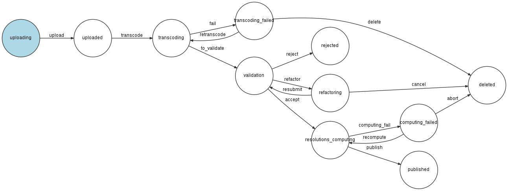

Fidustream
==========

*A Symfony project created on June 9, 2017, 10:31 am.*

## Installation
#### Dépendances
* Environnement système:
    * apache2
    * git
    * php      (>=5.4)
    * mysql
    * python   (>=3.0)
    * pip
* Framework:
    * symfony  (>=3.3)
    * composer (gestionnaire de dépendances pour symfony)
* Utilitaires:
    * ffmpeg   (gestion de conversion vidéo, voir la partie:"Conversion d'une vidéo")
    * ffprobe  (gestion de métadonnées de vidéo/inclus dans ffmpeg)
    * rabbit   (gestion de file de message pour communication entre symfony et le gestionnaire de conversion vidéo)
* Bibliothèques python:
    * ffmpy3   (bibliothèque python pour ffmpeg)
    * ffprobe3 (bibliothèque python pour ffprobe)
    * pika     (bibliothèque python pour rabbit)
#### Guide d'installation Centos 7
yum update
##### apache2
* yum -y install httpd
##### git
* yum install git
##### php (l'exemple est pour php 7)
* rpm -Uvh https://dl.fedoraproject.org/pub/epel/epel-release-latest-7.noarch.rpm 
* rpm -Uvh https://mirror.webtatic.com/yum/el7/webtatic-release.rpm
* yum install php70w
* yum install php70w-bcmath.x86_64  php70w-mbstring php70w-xml php70w-posix php70w-pdo.x86_64
##### mysql (tutoriel: https://www.digitalocean.com/community/tutorials/how-to-install-mysql-on-centos-7)
* wget https://dev.mysql.com/get/mysql57-community-release-el7-11.noarch.rpm
* rpm -ivh mysql57-community-release-el7-11.noarch.rpm
* yum install mysql-server (suivre les instructions)
* systemctl start mysqld  (pour lancer mysql)
###### Si il est impossible de se connecter avec le mot de passe entré pendant l'installation, suivre les instructions suivantes:
* grep 'temporary password' /var/log/mysqld.log (un mot de passe temporaire a été généré par mysql)
* mysql -u root -p (entrer le mot de passe temporaire pour se connecter)
* SET PASSWORD = PASSWORD("mot de passe temporaire); (modifier le mot de passe temporaire en le remplaçant par lui-même)
* uninstall plugin validate_password; (désactiver le plugin de validation de mot de passe)
* SET PASSWORD FOR 'root'@'localhost' = PASSWORD('root'); (mettre le mot de passe souhaité)
##### phpmyadmin (optionnel, permet l'administration des bases mysql)
* yum -y install epel-release
* yum install phpmyadmin (login:root/password:root)
##### python (l'exemple est pour 3.6)
* yum -y install https://centos7.iuscommunity.org/ius-release.rpm
* yum -y install python36u
##### pip
* yum -y install python36u-pip
##### Télécharger les sources
* Mettre le dossier des sources du projet dans le répertoire /var/www/html
##### composer
* su (se mettre en super-utilisateur)
* curl -sS https://getcomposer.org/installer | php (télécharge un fichier composer.phar)
##### ffmpeg
*Le projet contient une version compilée de ffmpeg qui inclut les librairies(non-inclues dans le package ffmpeg de base) utiles au projet*
* Se placer dans le répertoire du projet
* tar zxvf ffmpeg_build.tar.gz -C ~ (décompresser ffmpeg dans le répertoire home)

* ln -s -t /bin ~/ffmpeg_build/bin/ffmpeg(créer des liens symboliques vers les exécutables)
* ln -s -t /bin ~/ffmpeg_build/bin/ffprobe(créer des liens symboliques vers les exécutables)
* ln -s -t /bin ~/ffmpeg_build/bin/ffserver(créer des liens symboliques vers les exécutables)
##### rabbitmq
* wget http://www.rabbitmq.com/releases/rabbitmq-server/v3.6.10/rabbitmq-server-3.6.10-1.el7.noarch.rpm
* rpm --import https://www.rabbitmq.com/rabbitmq-release-signing-key.asc
* yum install rabbitmq-server-3.6.10-1.el7.noarch.rpm
* chkconfig rabbitmq-server on (permettre à rabbit de se lancer automatiquement au démarrage)
* /sbin/service rabbitmq-server start (démarrer rabbit)
##### rabbitmq_management (optionnel, permet l'administration des files rabbit)
* rabbitmq-plugins enable rabbitmq_management  (login:guest/password:guest)
##### ffmpy3
* pip3.6 install  ffmpy3
##### ffprobe3
* pip3.6 install ffprobe3
##### pika
* pip3.6 install pika
##### Création de la base de donnée
* php bin/console doctrine:database:create
##### Création des tables en base de donnée
* php bin/console doctrine:schema:update --dump-sql (voir les requêtes qui vont être envoyées)
* php bin/console doctrine:schema:update --force (lancer les requêtes)

##### Charger des utilisateurs de test en base de donnée
* php bin/console doctrine:fixtures:load

##### Enlever les limites d'upload pour php (pour le dev)
* Ouvrir le fichier /etc/php.ini
* Mettre la valeur de post_max_size à 0
* Mettre la valeur de upload_max_filesize à 0

##### Mettre à jour les dépendances
* Se placer dans le répertoire du projet /var/www/html/Fidustream
* Lancer la commande: 
    * php [path/to/composer.phar] update

##### Droits sur le dossier var du projet (peut nécessiter d'installer setfacl) (un chmod sur le dossier var marche aussi)
HTTPDUSER=$(ps axo user,comm | grep -E '[a]pache|[h]ttpd|[_]www|[w]ww-data|[n]ginx' | grep -v root | head -1 | cut -d\  -f1)
sudo setfacl -dR -m u:"$HTTPDUSER":rwX -m u:$(whoami):rwX var
sudo setfacl -R -m u:"$HTTPDUSER":rwX -m u:$(whoami):rwX var

#### Bundles
*Dans Symfony, on peut utiliser des blocs déjà existants: les Bundles.
Les bundles utilisés par le projet sont:*
* fos/user-bundle              (gestion avancée des utilisateurs)
* doctrine/doctrine-bundle     (gestion des entités )
* doctrine/orm                 (gestion des relations base de donnée/entité)
* twig/twig                    (moteur de templates)
* php-amqplib/rabbitmq-bundle  (interaction avec rabbit pour les files de message)

*L'ajout de nouveaux bundles se fait dans le fichier composer.json à la racine du projet. On ajoute la ligne du bundle dans le champ require.  
Exemple: "doctrine/doctrine-fixtures-bundle": "~2.3",  
 Le bundle est ensuite autorisé dans le fichier app/config/AppKernel.php. Dans le tableau $bundles.  
 Exemple: new Doctrine\Bundle\DoctrineBundle\DoctrineBundle(),*  

#### Composants symfony
*Symfony propose des composants déjà existants:*
* symfony/workflow         (gestion de workflow et de cycle de vie d'une entité)
* symfony/filesystem       (gestion des fichiers et dossiers du serveur)
* symfony/event-dispatcher (gestion des évènements pour symfony)

*L'ajout de nouveaux bundles se fait dans le fichier composer.json à la racine du projet. On ajoute la ligne du bundle dans le champ require.  
Exemple: "symfony/workflow ": "~2.3",*

Pour mettre à jour les dépendances, après ajout dans les fichiers composer.json et app/config/AppKernel.php on utilise la commande update de composer. Pour cela on se place à la racine du projet et on exécute la commande suivante:
* php [path/to/composer.phar] update

### Manuellement
Pour faire marcher l'application, il faut installer toutes les dépendances (partie "Dépendances"), télécharger le projet, se placer à la racine et mettre à jour les dépendances avec la commande:
* php [path/to/composer.phar] update

### Lancer l'application
Se placer à la racine du projet, ouvrir un terminal et lancer le serveur avec la commande suivante:  
* php bin/console server:start  
* Lancer les processus python de conversion vidéo dans différents terminaux (on peut lancer plusieurs fois le même processus en parallèle, la gestion des tâches est gérées):
    * python transcoding/transcodingReceiver.py (dans notre exemple, on utilisera la commande python3.6 transcoding/transcodingReceiver.py puisqu'on a installé la version 3.6)
    * python transcoding/resolutionReceiver.py
    * php bin/console rabbitmq:consumer workflow_consumer
    * php bin/console rabbitmq:consumer resolution_consumer
* Lancer le serveur Symfony:
    * php bin/console server:start
* Puis se rendre à l'adresse:   
    * [adresse du serveur][port du serveur]/video
* Connectez-vous avec l'un des utilisateurs suivant (pour plus de détails sur les droits, voir la section: "Authentification")
    * login: admin/ password: admin
    * login: contributor1/ password: contributor1
    * login: contributor2/ password: contributor2
    * login: moderator1/ password: moderator1
    * login: moderator2/ password: moderator2
    * login: viewer/ password: viewer

## Fonctionnalités de l'application
Dans cette partie sont décrites les principales fonctionnalités implémentées dans l'application.
### Cycle de vie d'une vidéo
La fonctionnalité principale de l'application est la gestion du cycle de vie d'une entité vidéo par un workflow.
Ce dernier est représenté ci-dessous.  
  
Voici une explication des étapes importantes:
#### Soumission
La vidéo est d'abord téléversée par un utilisateur.
Il lance ensuite la conversion de la vidéo.
Si la conversion réussi, la vidéo entre en attente de validation. 
#### Validation
##### Rejet
La vidéo peut être rejetée définitivement. Elle sera alors supprimée.
L'utilisateur doit laisser un message d'explication qui sera accessible par 
la personne ayant contribuée la vidéo.
##### Resoumission
La vidéo peut être jugée non conforme. Il sera alors demandé au contributeur de modifier les données de la vidéo. 
L'utilisateur doit laisser un message d'explication qui sera accessible par 
la personne ayant contribuée la vidéo.
Une fois les modifications effectuées le contributeur soumet à nouveau sa vidéo à la validation.
##### Publication
Si la vidéo est validée et que le calcul des résolutions est un succès, la vidéo est publiée.
#### Suppressions
Les transitions "delete", "cancel" et "abort" correspondent à l'abandon du workflow et conduisent à la suppression de la vidéo.
### Authentification
Dans l'application, toutes les pages ne sont pas accessibles à tous les utilisateurs. L'accès aux pages est régi par 4 profils utilisateurs types définis dans l'application (app/config/security.yml). 
#### Utilisateurs types
##### Le type viewer
* Le type viewer correspond à l'utilisateur de base de l'application, il ne peut que rechercher et lire des vidéos.
* La dénomination du rôle viewer dans le projet est ROLE_VIEWER.
* Pour tester l'application du point de vue viewer, on peut utiliser le login de test présent en base de donnée:
    * login: viewer
    * password: viewer
##### Le type contributor
* Le type contributor a les mêmes droits que le type viewer. Il dispose de droits supplémentaires. Il peut:
    * Téléverser une vidéo(tout en renseignant ses meta-données)
    * Lancer la conversion des vidéos
    * Accéder à la liste des vidéos qu'il a uploadée, voir leurs états courants dans le workflow et réagir en conséquence.
        * Si l'état est 'uploaded', il peut lancer la conversion 
        * Si l'état est 'refactoring', il peut prendre connaissance de la raison du rejet, modifier les données de la vidéo et la soumettre à nouveau au processus de validation. Ou supprimer la vidéo.
        * Si l'état est 'transcoding_failed' ou 'computing_failed' il peut voir le message d'erreur, et relancer l'opération ou choisr de supprimer la vidéo.
        * Dans les autres cas, il peut voir un résumé des données de la vidéo.
* La dénomination du rôle contributor dans le projet est ROLE_CONTRIBUTOR.
* Pour tester l'application du point de vue contributor, on peut utiliser les logins de test présents en base de donnée:
    * login: contributor1/ password: contributor1
    * login: contributor2/ password: contributor2

##### Le type moderator
* Le type contributor a les mêmes droits que le type viewer. Il dispose de droits supplémentaires. Il peut:
    * Sélectionner une vidéo dans la liste des vidéos en attente d'une validation de sa part.
    * Visionner la vidéo sélectionnée
    * Voir les meta-données 
    * Rejeter la vidéo (ce qui la supprimera définitivement) et transmettre un message au contributeur de la vidéo.
    * Demander une modification des données de la vidéo en l'indiquant dans un message au contributeur de la vidéo.
    * Valider la vidéo
* La dénomination du rôle moderator dans le projet est ROLE_MODERATOR.
* Pour tester l'application du point de vue moderator, on peut utiliser les logins de test présents en base de donnée:
    * login: moderator1/ password: moderator1
    * login: moderator2/ password: moderator2
##### Remarque
A un contributeur est associé un modérateur. Seul le modérateur associé pourra valider la vidéo.
Pour les tests, les couples contributeur/modérateur sont les suivants:
* moderator1/contributor1
* moderator2/contributor2
##### Le type admin
Il peut effectuer toutes les actions.
#### Gestion des droits d'accès
##### Aux pages
Pour limiter l'accès aux pages, aux utilisateurs ayant un certain rôle.
Il faut mettre une annotation avant la fonction permettant le chargement de la page dans le controller(src/FIDUSTREAM/VideoBundle/Controller/VideoController.php).
* Exemple:  
    /**  
    *@Security("has_role('ROLE_VIEWER')")  
    */  
    public function playerAction($id, Request $request){}  

##### Aux actions au sein d'une page
On peut vouloir autoriser l'accès à une page pour tous les utilisateurs mais vouloir limiter certaines actions à certains rôles utilisateurs.
Pour ce faire, on peut mettre des conditions dans les templates.
* Exemple: 
### Droits sur les vidéos
Tous les viewers ne peuvent pas accéder à l'ensemble des vidéos.
La restriction d'accès se fait selon un niveau de hiérarchie.
Le niveau de hiérarchie va de 15 (le plus restrictif) à 1 (le moins restrictif)
On associe un niveau à chaque vidéo et à chaque utilisateur.
Un utilisateur pourra lire une vidéo seulement si le niveau de l'utilisateur est inférieur ou égal (numériquement) au niveau de la vidéo.
* Exemple: Un utilisateur de niveau 3 peut lire une vidéo de niveau 13.  
### Téléversement de vidéo
Un contributeur peut uploader une vidéo.
* Il doit sélectionner la vidéo sur son ordinateur.
* Renseigner le titre de la vidéo.
* Renseigner la description de la vidéo.
* Renseigner les tags de la vidéo.
* Renseigner le niveau de hiérarchie de la vidéo.
* Les vidéos sont stockées dans le dossier web/uploads de la manière suivante:
    * Un dossier par utilisateur (le nom du dossier est l'identifiant de l'utilisateur).
    * Dans ce dossier, un dossier par vidéo (le nom du dossier est l'identifiant de la vidéo).
    * Dans ce dossier, 3 dossiers:
        * Un dossier nommé "original" contenant la vidéo originale.
        * Un dossier nommé "mp4" contenant la vidéo convertie au format mp4 en différentes résolutions.
        * Un dossier nommé "webm" contenant la vidéo convertie au format webm en différentes résolutions.
Le mécanisme de chargement du fichier est géré dans la classe de l'entité vidéo (src/FIDUSTREAM/VideoBundle/Entity/Video.php) dans les fonctions preUpload et upload.
### Recherche de vidéo
La recherche d'une vidéo consiste en une requête SQL.
Elle prend en entrée une chaine de caractère (3 caractères minimum) et le niveau de l'utilisateur.
La requête regarde si la chaîne de caractère est contenue dans le titre,dans la description ou dans les tags et regarde si le niveau de l'utilisateur est assez haut pour lire la vidéo.
La requête retourne la liste des vidéos satisfaisant ces critères. 
### Visionnage d'une vidéo
Le lecteur de la vidéo utilise la librairie videojs.
Cette librairie se base sur la technologie html5.

Par publication, on désigne l'état final du workflow. Quand la vidéo est publiée, elle est disponible à la recherche par les viewers. Elle est aussi visionnable en plusieurs résolutions (360p, 480p,720p par exemple).
#### Avant publication
Une fois la vidéo téléversée et la conversion effectuée, la vidéo est visible uniquement par le modérateur chargé de la valider.
Il peut lire la vidéo dans sa qualité d'origine.
#### Après publication
Une fois la vidéo publiée, elle est visible par tous les utilisateurs disposant du niveau d'accréditation suffisant. Elle est de surcroit disponible en plusieurs qualités que l'utilisateur peut sélectionner depuis le lecteur. La sélection des qualités se fait grâce au module videojs: videojs-resolution-switcher.
### Conversion d'une vidéo
#### Formats
Pour pouvoir lire une vidéo dans un navigateur, celle ci doit être convertie aux formats mp4 ou webm.
Par format mp4, on désigne: (Container:  MPEG-4, Video Codec: H.264, Audio Codec: aac ).
 
Par format webm, on désigne: (Container:  WebM, Video Codec: VP9, Audio Codec: Opus ).  
Pour assurer la compatibilité avec tous les navigateurs, on convertit chaque vidéo dans ces deux formats. Ainsi, si un format n'est pas géré par le navigateur, l'autre est utilisé à la place.

Quand le contributeur, lance la conversion, une transition est effectuée dans le workflow. Cela génère un évènement. Cet évènement est capté par symfony qui envoie un message à un récepteur externe à l'application via une file de message rabbit. Le message contient les informations nécessaires à la conversion de la vidéo. Quand le récepteur reçoit un message, il exécute le travail de conversion. Une fois le travail achevé ou échoué, il envoie un message de succès ou d'échec à l'application web via une autre file rabbit. L'application se charge alors de mettre à jour le statut de la vidéo et de lancer la suite du workflow.

##### Remarque: On pourra utiliser la version de ffmpeg proposée dans le projet. Il s'agit d'une version compilée à la main qui inclut les bibliothèques dont on a besoin (aac, vp8, vp9 ...). L'utilisation en est précisée dans le guide d'installation des dépendances.
#### Résolutions
Dans l'application web, une vidéo publiée l'est en plusieurs résolutions. Le calcul des résolutions est lancée automatiquement une fois la vidéo validée. En effet, il est inutile de faire la conversion si la vidéo est ensuite rejetée. Le principe d'évènement et de message est le même que pour le paragraphe précédent.
Pour déterminer en quelles résolutions la vidéo sera convertie, on le fait de la manière suivante:
* La résolution originale est la résolution la plus haute disponible.
* Pour chaque hauteur standard du format 16:9 inférieure à la hauteur d'origine, on calcule la largeur associée qui conserve le ratio de la vidéo originale.
Exemple: Pour une vidéo 1080p, elle sera convertie en 360p, 480p et en 720p.

## Fonctionnement général de l'application (Cas d'utilisation)
### Le viewer
Le viewer se connecte. Il arrive à la page d'accueil.
Il peut choisir de chercher une vidéo ou sélectionner une vidéo dans la liste des vidéos récemment uploadées.
Si il fait une recherche, la liste des vidéos correspondant à l'intitulé de la recherche s'affiche.
Il en choisit une et arrive sur la page de lecture vidéo.
Il peut lire la vidéo et ses métadonnées. Choisir la résolution de la vidéo.
### Le contributeur
Le contributeur se connecte. Il arrive à la page d'accueil.
Trois possibilités s'offrent à lui, il peut choisir de chercher une vidéo, il peut contribuer une vidéo ou il peut consulter la liste des vidéos qu'il a contribué pour voir où en est leur état.
Il arrive sur la page de contribution. Il sélectionne la vidéo sur son ordinateur. Renseigne le titre, la description, les tags et le droit d'accès de la vidéo. Il valide, la vidéo est téléversée. 
Il arrive sur la page de résumé de la vidéo. Il a la possibilité de lancer la conversion de la vidéo.
Il peut le faire immédiatement ou plus tard à travers la liste des vidéos qu'il a contribué.
Il lance la conversion de la vidéo. Il retourne à l'accueil. Il va voir la liste des vidéos qu'il a contribué. Il peut consulter l'état de la vidéo qu'il a contribué:
* Si l'état est 'uploaded', il peut lancer la conversion 
* Si l'état est 'refactoring', il peut prendre connaissance de la raison du rejet, modifier les données de la vidéo et la soumettre à nouveau au processus de validation. Ou supprimer la vidéo.
* Si l'état est 'transcoding_failed' ou 'computing_failed' il peut voir le message d'erreur, et relancer l'opération ou choisr de supprimer la vidéo.
* Dans les autres cas, il peut voir un résumé des données de la vidéo.
### Le modérateur
Le modérateur se connecte. Il arrive à la page d'accueil.
Deux possibilités s'offrent à lui, il peut choisir de chercher une vidéo, il peut accéder à la liste des vidéos en attente de sa validation.
Il arrive sur la page listant les vidéos à valider.
Il en choisit une.
Il arrive sur la page de validation de la vidéo. 
Il peut lire la vidéo en qualité originale et voir les méta-données.
Dans le cadre du processus de validation, il a trois possibilités:
* Rejeter définivement le vidéo en en indiquant la raison au contributeur dans un message.
* Demander au contributeur de modifier les méta-données en lui laissant en message.
* Valider la vidéo
Il peut ensuite retourner à la liste des vidéos à valider ou à l'accueil. 
## Explication succinte de la hiérarchie du projet
### Configuration du projet
    * app/AppKernel.php:
        * Déclarer les bundles dans l'application

    * app/config/config.yml
        * Permet de configurer les bundles (twig,doctrine,fos-user, rabbit)
        * Inclus les fichiers workflow.yml, services.yml et parameters.yml
    * app/config/parameters.yml
        * Permet de setter les paramètres utilisés par les bundles (base de données )
    * app/config/routing.yml
        * Déclare l'url (la route) de base /video
        * Déclare les urls (routes) de base utilisées par fos/user-bundle (login,logout etc...)
    * app/config/security.yml
        * Permet de déclarer les différents types d'utilisateurs ainsi que la hiérarchie de ces types.
        * Permet de configurer le firewall de l'application symfony pour le fos/user_bundle
    * app/config/services.yml
        * Permet de déclarer des services (classes pouvant être appelées dans toute l'application)
        * Sont définis dans ce fichier:
            * Les émetteurs et récepteurs pour rabbit
            * Le repository (méthodes de recherche dans la base de données) de l'entité vidéo
            * Le service de listener sur les évènements déclenchés par le workflow de l'objet vidéo 
    * app/config/workflow.yml
        * Définition du workflow de l'entité vidéo (états et transitions)
### UserBundle
    * src/FIDUSTREAM/UserBundle 
        * Racine du bundle UserBundle qui permet la gestion des utilisateurs 
    * src/FIDUSTREAM/UserBundle/Entity/User.php
        * Classe décrivant l'entité User qui hérite de celle du fos/user_bundle
    * src/FIDUSTREAM/UserBundle/DataFixtures/ORM/LoadUser.php
        * Classe de fixtures permettant de mettre des utilisateurs de test en base de donnée.
### VideoBundle
    * src/FIDUSTREAM/VideoBundle
        * Racine du bundle VideoBundle qui permet la gestion des vidéos
    * src/FIDUSTREAM/VideoBundle/Controller/VideoController.php
        * Le controlleur liste les actions, qui sont les méthodes appelées lorsue l'url correspondante est appelée
        
    * src/FIDUSTREAM/VideoBundle/Entity/Video.php
        * Ce fichier décrit l'entité vidéo, gère l'upload du fichier vidéo associé et permet de récupérer différents chemins utiles au fonctionnement de l'application.
        * L'upload est géré par des fonctions associées aux évènements (prePersist, postPersist)
    * src/FIDUSTREAM/VideoBundle/Form/VideoType.php
        * Ce fichier décrit les champs du formulaire utilisé pour uploader une vidéo. Le formulaire est utilisé comme objet dans le controller (uploadAction)
    * src/FIDUSTREAM/VideoBundle/Repository/VideoRepository.php
        * Ce fichier décrit le repository de l'entité vidéo, un service qui recense toutes les méthodes d'accès à l'objet vidéo en base de donnée
    * src/FIDUSTREAM/VideoBundle/Resources/config/routing.yml
        * Ce fichier liste toutes les urls(routes) utilisées dans l'application.
        * Elles sont préfixées par /video qui est l'url de base de l'application, définie dans app/config/routing.yml
#### Modèles pour les pages du site:
    * src/FIDUSTREAM/VideoBundle/Resources/views/base.html.twig
        * Vue contenant les blocs de base dont hériteront toutes les autres vues.
        * Les inclusions de bibliothèques javascript et css se font ici.
        * Contient la barre de navigation du site avec les différentes actions possibles.
    * src/FIDUSTREAM/VideoBundle/Resources/views/Video/moderator.html.twig
        * Vue affichant la liste des vidéos à valider pour le modérateur actuellement connecté.
    * src/FIDUSTREAM/VideoBundle/Resources/views/Video/player.html.twig
        * Vue permettant de lire une vidéo et de visualiser ses données.
    * src/FIDUSTREAM/VideoBundle/Resources/views/Video/refactor.html.twig
        * Vue permettant de modifier les données d'une vidéo lors d'une resoumission.
    * src/FIDUSTREAM/VideoBundle/Resources/views/Video/rejected.html.twig
        * Vue affichant le message donnant la raison du rejet définitif d'une vidéo par un modérateur.
    * src/FIDUSTREAM/VideoBundle/Resources/views/Video/resume.html.twig
        * Vue affichant un résumé de informations d'une vidéo et proposant des actions relatives à la conversion en fonction du contexte.
    * src/FIDUSTREAM/VideoBundle/Resources/views/Video/search.html.twig
        * Page d'accueil qui permet de chercher une vidéo et de voir la liste des vidéos récentes.
    * src/FIDUSTREAM/VideoBundle/Resources/views/Video/upload.html.twig
        * Vue associée au téléversement d'une vidéo.
    * src/FIDUSTREAM/VideoBundle/Resources/views/Video/uploaded.html.twig
        * Vue affichant la liste des vidéos en cours de traitement pour le contributeur actuellement connecté.
#### Gestion des évènements liés au workflow 
    * src/FIDUSTREAM/VideoBundle/Workflow/WorkflowListener.php
        * Cette classe est le listener des évènements déclenchés par le workflow.
        * A chaque transition dans le workflow, un évènement est déclenché
        * Cette classe appelle les méthodes associées aux évènements du workflow.
    * src/FIDUSTREAM/VideoBundle/Workflow/WorkflowTranscoder.php
        * Cette classe regroupe les fonctions ,appelées par le workflowListener, relatives à la conversion de la vidéo associée au workflow.
        * La vidéo sera convertie de son format(codec/container) initial aux formats webm et mp4 (formats compatibles html5)
        * Les méthodes ne sont pas exécutées par cette classe. Celle-ci se charge uniquement d'envoyer les conversions à faire dans une file. 
        * Les conversions seront effectuées de manière asynchrone à l'extérieur de l'application.
    * src/FIDUSTREAM/VideoBundle/Workflow/ResolutionTranscoder.php
        * Cette classe regroupe les fonctions ,appelées par le workflowListener, relatives au calcul des résolutions de la vidéo associée au workflow.
        * La vidéo sera convertie de sa résolution initiale à différentes résolutions inférieures. 
        * Les méthodes ne sont pas exécutées par cette classe. Celle-ci se charge uniquement d'envoyer les conversions à faire dans une file. 
        * Les conversions seront effectuées de manière asynchrone à l'extérieur de l'application.
    * src/FIDUSTREAM/VideoBundle/Workflow/ResolutionConsumer.php
        * Définit un consommateur qui reçoit depuis une file, les résultats des opérations de calcul de résolution.
    * src/FIDUSTREAM/VideoBundle/Workflow/WorkflowConsumer.php
        * Définit un consommateur qui reçoit depuis une file, les résultats des opérations de conversion vidéo.
  #### Style et script
    * /web/css/style.css
        * Contient le css permettant de cacher/afficher des onglets
    * /web/js/script.js
        * Contient le javascript permettant l'interaction avec la barre de navigation et les onglets.
    
### Conversion de videos (format/résolution)
    * transcoding/resolutionReceiver.py
        * Externe à l'application.
        * Reçoit les messages de demande de conversion vidéo et lance les opérations associées.
    * transcoding/transcodingReceiver.py
        * Externe à l'application.
        * Reçoit les messages de demande de calcul de résolutions et lance les opérations associées.
     * transcoding/transcoder.py
        * Regroupe les fonctions de conversion
### Stockage des vidéos
    * Une vidéo est stockée de la manière suivante:
        * /web/uploads/user_id/video_id/mp4
            * Contient la vidéo au format mp4 et ses différentes résolutions
        * /web/uploads/user_id/video_id/original
            * Contient la vidéo originale (celle uploadée par le contributeur)
        * /web/uploads/user_id/video_id/webm
            * Contient la vidéo au format webm et ses différentes résolutions
        

#### Guide d'installation Ubuntu
sudo apt-get update
##### apache2
* sudo apt-get install apache2
##### git
* sudo apt-get install git
##### php 
* sudo apt-get install php
##### mysql 
* sudo apt-get install mysql-server (root/root)
##### phpmyadmin (optionnel, permet l'administration des bases mysql)
* yum -y install epel-release
* yum install phpmyadmin (login:root/password:root)
##### python
* sudo apt-get install python3
##### pip
* sudo apt-get install python3-pip
##### Télécharger les sources
* Mettre le dossier des sources du projet dans le répertoire /var/www/html
##### composer
* su (se mettre en super-utilisateur)
* curl -sS https://getcomposer.org/installer | php (télécharge un fichier composer.phar)
##### ffmpeg
*Le projet contient une version compilée de ffmpeg qui inclut les librairies(non-inclues dans le package ffmpeg de base) utiles au projet*
* Se placer dans le répertoire du projet
* tar zxvf ffmpeg_build.tar.gz -C ~ (décompresser ffmpeg dans le répertoire home)

* ln -s -t /bin ~/ffmpeg_build/bin/ffmpeg(créer des liens symboliques vers les exécutables)
* ln -s -t /bin ~/ffmpeg_build/bin/ffprobe(créer des liens symboliques vers les exécutables)
* ln -s -t /bin ~/ffmpeg_build/bin/ffserver(créer des liens symboliques vers les exécutables)
##### rabbitmq
* echo 'deb http://www.rabbitmq.com/debian/ testing main' | sudo tee /etc/apt/sources.list.d/rabbitmq.list
* wget -O- https://www.rabbitmq.com/rabbitmq-release-signing-key.asc | sudo apt-key add -
* sudo apt-get install rabbitmq-server
##### rabbitmq_management (optionnel, permet l'administration des files rabbit)
* rabbitmq-plugins enable rabbitmq_management  (login:guest/password:guest)
##### ffmpy3
* pip3 install  ffmpy3
##### ffprobe3
* pip3 install ffprobe3
##### pika
* pip3 install pika
##### Création de la base de donnée
* php bin/console doctrine:database:create
##### Création des tables en base de donnée
* php bin/console doctrine:schema:update --dump-sql (voir les requêtes qui vont être envoyées)
* php bin/console doctrine:schema:update --force (lancer les requêtes)

##### Charger des utilisateurs de test en base de donnée
* php bin/console doctrine:fixtures:load

##### Enlever les limites d'upload pour php (pour le dev)
* Ouvrir le fichier /etc/php.ini
* Mettre la valeur de post_max_size à 0
* Mettre la valeur de upload_max_filesize à 0

##### Mettre à jour les dépendances
* Se placer dans le répertoire du projet /var/www/html/Fidustream
* Lancer la commande: 
    * php [path/to/composer.phar] update

##### Droits sur le dossier var du projet
HTTPDUSER=$(ps axo user,comm | grep -E '[a]pache|[h]ttpd|[_]www|[w]ww-data|[n]ginx' | grep -v root | head -1 | cut -d\  -f1)
sudo setfacl -dR -m u:"$HTTPDUSER":rwX -m u:$(whoami):rwX var
sudo setfacl -R -m u:"$HTTPDUSER":rwX -m u:$(whoami):rwX var